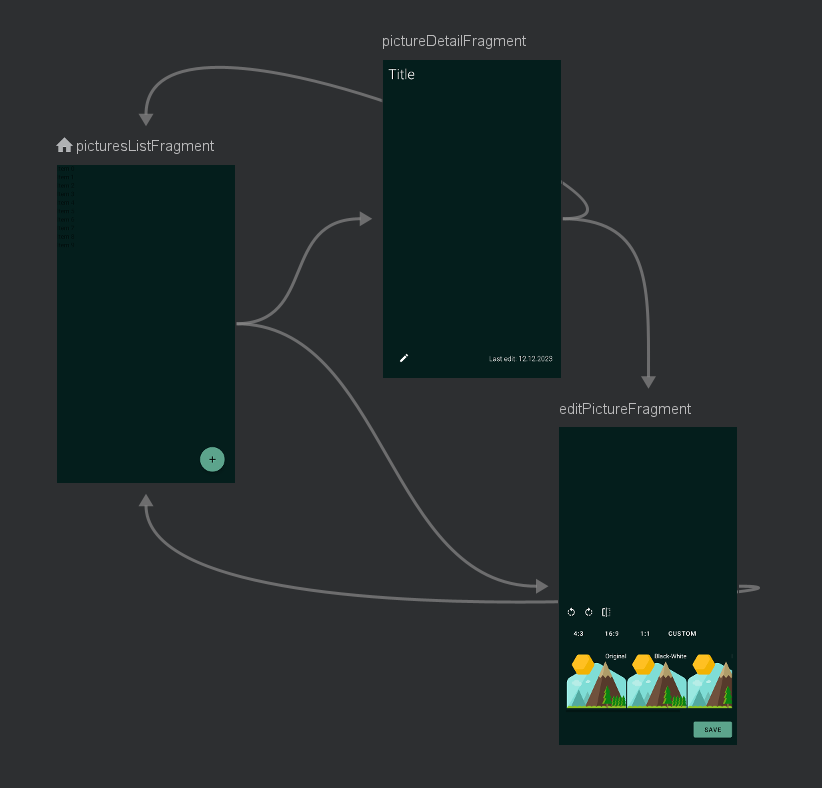
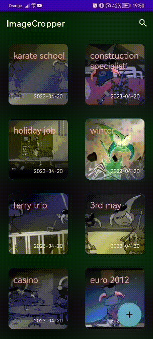

# PhotoEditor

In **PhotoEditor** app you can take photo using your camera or choose picture from your gallery and do some simple editing with it. You can apply one of 3 filters, resize and turn around your picture.  ⚡


App was built using libraries such as:
* **Room Database** 🗃
* **Navigation Component** 🗺
* **Android-Image-Cropper** ✂
* **Hilt** 💉
* **Glide** 🖌
* **DataStore** 🗃

with MVVM architecture.

## Navigation

App uses **Navigation Component** and contains single activity which is navHost for all fragments. 




To navige between fragment I decided to use **actions** what allows to pass arguments.

I also used **Shared Element Transition** what results in smoother and nice looking animations.


## Storing pictures

Every picture is represented by data class: **PictureItem** which is used in whole application except of inserting and reading from database. Class has reference to original picture, because it simplifies editing already posted picture.
Class is **Parcelable** to simplifie passing object between fragments.

```kotlin
@Parcelize
data class PictureItem(
    var id: Int? = null,
    val picture: String? = null,
    val originalPicture: String? = null,
    val title: String = "",
    val lastEdit: LocalDate = LocalDate.now(),
): Parcelable
```
There is also class dedicated to database:
```kotlin
@Entity
data class PictureEntity(

    @PrimaryKey(autoGenerate = true)
    val id: Int? = null,
    val picture: String,
    val originalPicture: String,
    val title: String,
    val date: LocalDate

)
```
And there are mappers to keep domain and data parts of application seperated:

```kotlin
fun PictureEntity.toPictureItem(): PictureItem {
    return PictureItem(
        id = id,
        picture = picture,
        originalPicture = originalPicture,
        title = title,
        lastEdit = date
    )
}

fun PictureItem.toPictureEntity(): PictureEntity {
    return PictureEntity(
        id = this.id,
        picture = this.picture!!,
        originalPicture = this.originalPicture!!,
        title = this.title,
        date = this.lastEdit
    )
}
```

At the beginnig of develompent I decided to store all pictures as bitmaps in database. I created special **TypeConverter** for Bitmaps to convert them to ByteArrays, because Bitmaps can't be stored in Room Database. It resulted in long loading time in list fragment, so I deciced to store Uri path in database what decreased loading time a lot.


## Functionality

Using **PhotoEditor** App you can: 
* choose picture from your gallery,
```kotlin
private val getImageFromGallery = registerForActivityResult(ActivityResultContracts.GetContent()) { uri: Uri? ->
        if(uri == null) return@registerForActivityResult

        val picture = PictureItem(
            picture = uri.toString(),
            originalPicture = uri.toString()
        )

        val action = PicturesListFragmentDirections.actionPicturesListFragmentToEditPictureFragment(picture)
        navController.navigate(action)
    }
```
* take photo
```kotlin
private var mImageUri: Uri? = null
    private val getImageFromCamera = registerForActivityResult(
        ActivityResultContracts.TakePicture(),
    ) { isTaken ->
        if(isTaken) {
            mImageUri.let { uri ->
                val picture = PictureItem(
                    picture = uri.toString(),
                    originalPicture = uri.toString()
                )
                val action = PicturesListFragmentDirections.actionPicturesListFragmentToEditPictureFragment(picture)
                navController.navigate(action)
            }

        }
    }
```
and edit it. 

For cropping and turning pictures I used [Android-Image-Cropper](https://github.com/ArthurHub/Android-Image-Cropper) 
library and integrated it in fragment responsible for editing insted of using seperate Activity just for cropping and rotating pictures what was easier approach. It results in better UX because user can resize, rotate and apply filters on single screen.

For applying filters on pictures I created seperate class that uses **ColorMatrixColorFilter** on Bitmap.

It is handled in ViewModel by method: 

```kotlin
private fun addFilter(filterType: FilterType, context: Context){

        val originalUri = _editedPicture.value.originalPicture ?: return
        val pf = PictureFilter(uri = Uri.parse(originalUri), context)

        when(filterType) {
            is FilterType.BlackAndWhite -> _editedBitmap.value = pf.blackAndWhitePicture()
            is FilterType.Invert -> _editedBitmap.value = pf.invertPicture()
            is FilterType.Sepia -> _editedBitmap.value = pf.sepiaPicture()
            is FilterType.Normal -> {
                val uri = Uri.parse(_editedPicture.value.originalPicture)
                _editedBitmap.value = uri.toBitmap(context)

            }
        }
    }
```

App also has **SearchBar** what allows user search saved pictures by names.


